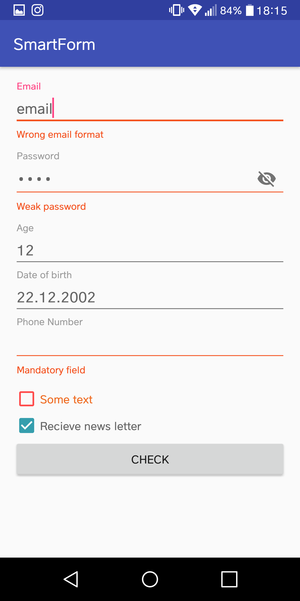

# SmartForm 
SmartForm is a library that allows you to create easy forms that can be validated in one line, from Email to password, gender, dates and addresses. All in one place!

# Video

Coming soon!

# Screenshots

# How to use

<h4><b> Gradle: </b></h4>

Add it in your root build.gradle at the end of repositories:

	allprojects {
		repositories {
			...
			maven { url 'https://jitpack.io' }
		}
	}

Step 2. Add the dependency

	dependencies {
	        compile 'com.github.TeleClinic:SmartForm:1.0.0'
	}
  
<h4><b> Maven: </b></h4>

	<repositories>
		<repository>
		    <id>jitpack.io</id>
		    <url>https://jitpack.io</url>
		</repository>
	</repositories>
Step 2. Add the dependency

	<dependency>
	    <groupId>com.github.TeleClinic</groupId>
	    <artifactId>SmartForm</artifactId>
	    <version>1.0.0</version>
	</dependency>

# Summary 

    <com.teleclinic.kabdo.smartform.SmartFormLinearLayout
        android:id="@+id/form"
        android:layout_width="match_parent"
        android:layout_margin="16dp"
        android:layout_height="wrap_content"
        android:orientation="vertical">

        <com.teleclinic.kabdo.smartform.SmartEditText
            android:id="@+id/emailSmartEditText"
            android:layout_width="match_parent"
            android:layout_height="wrap_content"
            app:setLabel="Email"
            app:setMandatoryErrorMsg="Mandatory field"
            app:setRegexErrorMsg="Wrong email format"
            app:setRegexType="EMAIL_VALIDATION" />

        <com.teleclinic.kabdo.smartform.SmartEditText
            android:id="@+id/passwordSmartEditText"
            android:layout_width="match_parent"
            android:layout_height="wrap_content"
            app:setLabel="Password"
            app:setMandatoryErrorMsg="Mandatory field"
            app:setPasswordField="true"
            app:setRegexErrorMsg="Weak password"
            app:setRegexType="MEDIUM_PASSWORD_VALIDATION" />

        <com.teleclinic.kabdo.smartform.SmartEditText
            android:id="@+id/ageSmartEditText"
            android:layout_width="match_parent"
            android:layout_height="wrap_content"
            app:setLabel="Age"
            app:setMandatoryErrorMsg="Mandatory field"
            app:setRegexErrorMsg="Weak password"
            app:setRegexString=".*\\d.*" />

        <com.teleclinic.kabdo.smartform.SmartDateOfBirthEditText
            android:id="@+id/dobSmartEditText"
            android:layout_width="match_parent"
            android:layout_height="wrap_content"
            app:sdofLabel="Date of birth"
            app:sdofMandatoryErrorMsg="Mandatory field" />

        <com.teleclinic.kabdo.smartform.SmartClickableEditText
            android:id="@+id/clickSmartEditText"
            android:layout_width="match_parent"
            android:layout_height="wrap_content"
            app:scetLabel="Phone Number"
            app:scetMandatoryErrorMsg="Mandatory field" />

        <com.teleclinic.kabdo.smartform.SmartCheckBoxLayout
            android:id="@+id/termsCheckbox"
            android:layout_width="match_parent"
            android:layout_height="wrap_content"
            android:text="Terms and conditions"
            app:scblColor="@color/gold"
            app:scblErrorColor="@color/red"
            app:scblTextColor="@color/orangeDark" />

        <com.teleclinic.kabdo.smartform.SmartCheckBox
            android:id="@+id/newsCheckbox"
            android:layout_width="match_parent"
            android:layout_height="wrap_content"
            android:text="Recieve news letter"
            app:scbMandatory="false" />

        <Button
            android:id="@+id/button"
            android:layout_width="match_parent"
            android:layout_height="wrap_content"
            android:text="check" />
    </com.teleclinic.kabdo.smartform.SmartFormLinearLayout>

In your activity all you need is: <b>form.check()</b> !

    override fun onCreate(savedInstanceState: Bundle?) {
        super.onCreate(savedInstanceState)
        setContentView(R.layout.activity_main)
        button.setOnClickListener { if (form.check()) continueWithYourCode() }
        termsCheckbox.textView().setOnClickListener { Toast.makeText(this, "Do something", Toast.LENGTH_SHORT).show() }
        clickSmartEditText.editText().setOnClickListener { Toast.makeText(this, "Do something", Toast.LENGTH_SHORT).show() }
    }

# Components 

* <h4> SmartEditText </h4>

<b>TO USE</b>

    <com.teleclinic.kabdo.smartmaterialedittext.CustomViews.SmartEditText
        android:id="@+id/emailSmartEditText"
        android:layout_width="match_parent"
        android:layout_height="wrap_content"
        app:setLabel="Email"
        app:setMandatoryErrorMsg="Mandatory field"
        app:setRegexErrorMsg="Wrong email format"
        app:setRegexType="EMAIL_VALIDATION" />

    
    emailSmartEditText.check()

<b> ATTRIBUTES </b>

setLabel --> Change the label for the EditTextLayout

setTextColor --> Change the text color, for more customizations you can edit the theme style in your styles file!

setMandatory --> Enables validating if the field is filled or not

setMandatoryErrorMsg --> If the field is mandatory and it was not filled, after using .check(), the error message will be displayed below

setRegexType --> Pre defined validatons

    * EMAIL_VALIDATION: Default android regex
    * MEDIUM_PASSWORD_VALIDATION:  8+ letters with 2 out of (a-z, A-Z, digit, sign)
    * COMPLEX_PASSWORD_VALIDATION: 8+ letters with all 4 (a-z, A-Z, digit, sign)
    * PHONE_NUMBER_VALIDATION: Default android regex
    * NAME_VALIDATION: 2 letters+

setRegexString string --> if you want another fancier regex, just enter it here
setRegexErrorMsg string --> Error message text for when the field is not valid according to the regex
setPasswordField --> hides the letters and shows the eye sign to show/hide password 

<b> EXAMPLES </b>

    <com.teleclinic.kabdo.smartmaterialedittext.CustomViews.SmartEditText
        android:id="@+id/emailSmartEditText"
        android:layout_width="match_parent"
        android:layout_height="wrap_content"
        app:setLabel="Email"
        app:setMandatoryErrorMsg="Mandatory field"
        app:setRegexErrorMsg="Wrong email format"
        app:setRegexType="EMAIL_VALIDATION" />

    <com.teleclinic.kabdo.smartmaterialedittext.CustomViews.SmartEditText
        android:id="@+id/passwordSmartEditText"
        android:layout_width="match_parent"
        android:layout_height="wrap_content"
        app:setLabel="Password"
        app:setMandatoryErrorMsg="Mandatory field"
        app:setPasswordField="true"
        app:setRegexErrorMsg="Weak password"
        app:setRegexType="MEDIUM_PASSWORD_VALIDATION" />

    <com.teleclinic.kabdo.smartmaterialedittext.CustomViews.SmartEditText
        android:id="@+id/ageSmartEditText"
        android:layout_width="match_parent"
        android:layout_height="wrap_content"
        app:setLabel="Age"
        app:setMandatoryErrorMsg="Mandatory field"
        app:setRegexErrorMsg="Is that really your age :D?"
        app:setRegexString=".*\\d.*" />

# Progress

DONE: Email, Password, Name, Phone Edittexts with easy Validations. Dates, Checkboxes, Checkbox with clickable text and Forms in Linear/Relative/Constraint Layouts

TODO: Gender, Address

